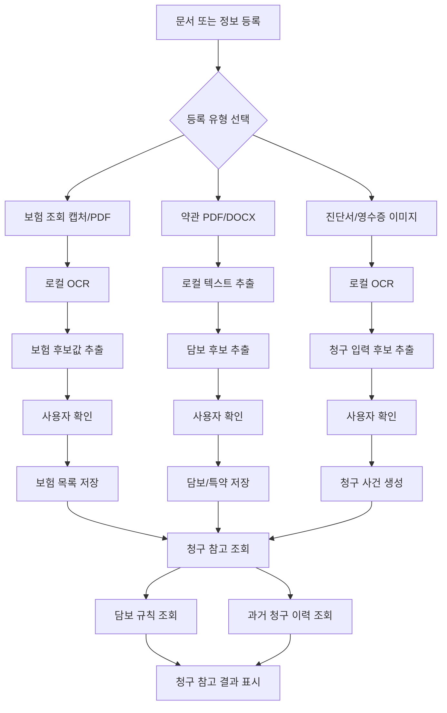
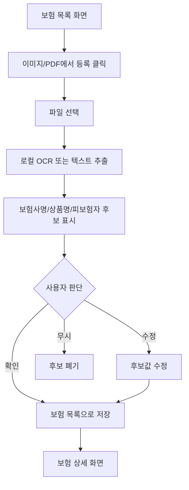
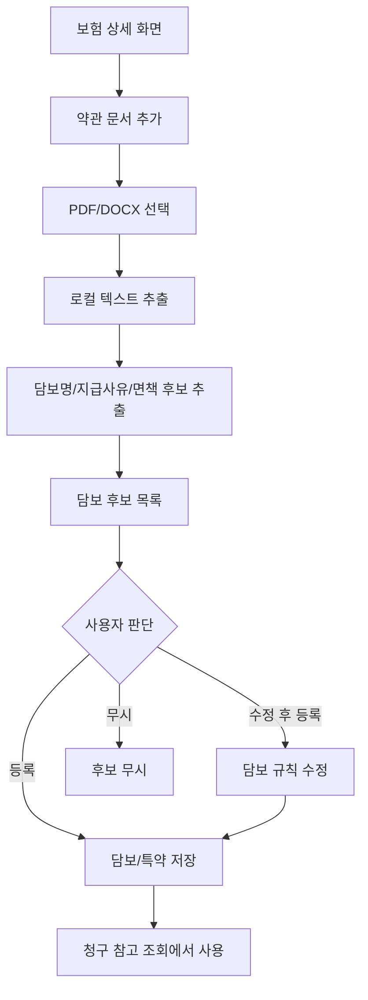
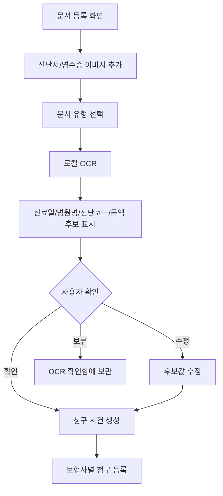
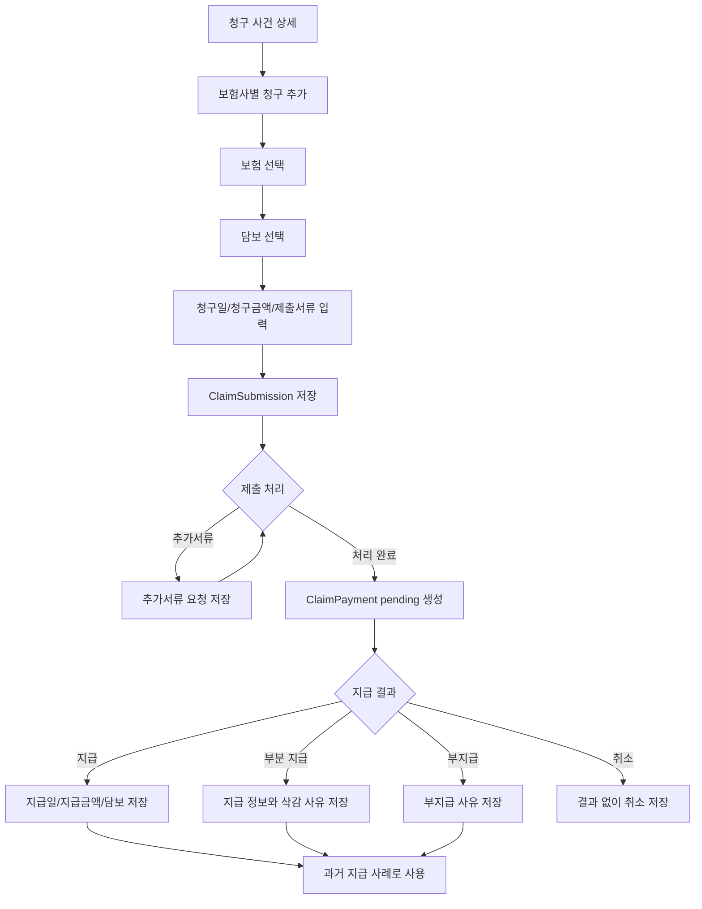
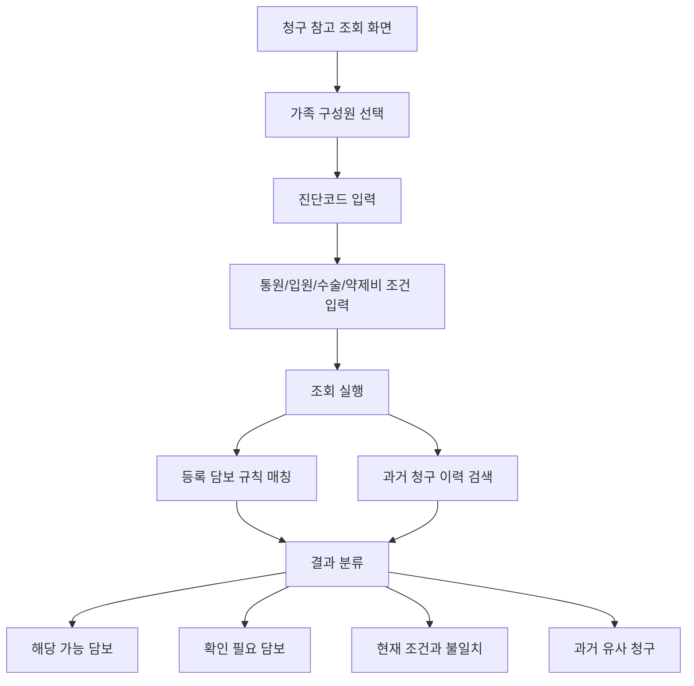
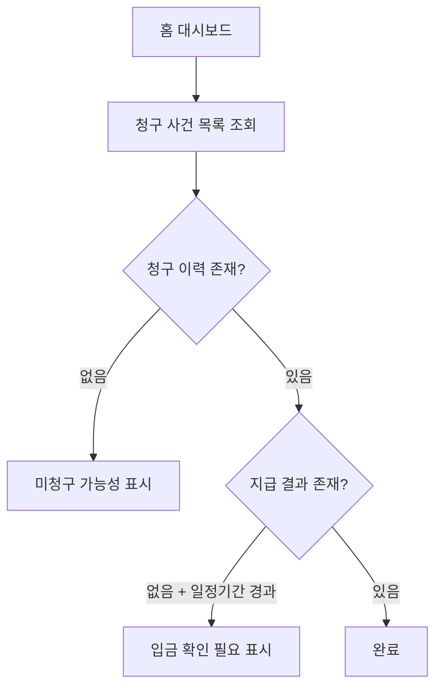

# 유저플로우: 가족 보험 청구 참고 조회기

## 1. 전체 핵심 흐름

---

## 2. 보험 목록 반자동 등록 흐름

---

## 3. 약관 담보 후보 등록 흐름

---

## 4. 병원 서류 OCR 및 청구 사건 생성 흐름

---

## 5. 보험사별 청구 및 지급 결과 흐름

---

## 6. 청구 참고 조회 흐름

---

## 7. 미청구/입금 확인 흐름

