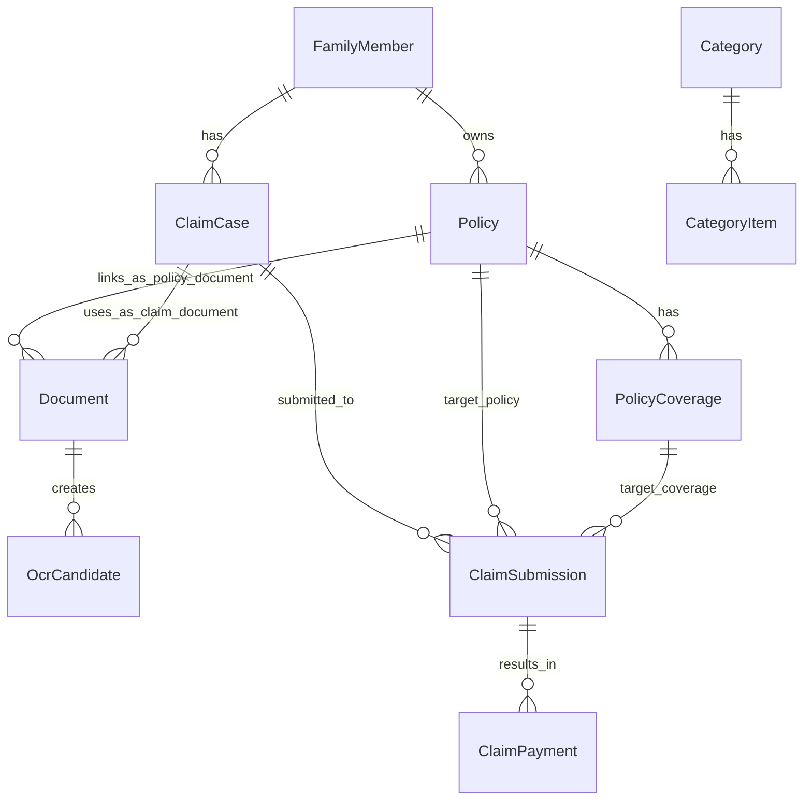

# 데이터 모델 초안

## 1. 설계 원칙

- OCR 원문과 사용자 확정 데이터를 분리한다.
- OCR 후보값은 업무 객체에 자동 반영하지 않는다.
- 사용자 확정값만 업무 객체에 반영한다.
- 청구 사건과 보험사별 청구 이력을 분리한다.
- 보험사별 청구 이력과 실제 지급 결과를 분리한다.
- 계좌번호, 주민번호, 카드번호는 저장하지 않는다.
- 원본 문서는 로컬 attachments 폴더에 저장하고 DB에는 경로와 메타데이터만 저장한다.
- 파일명에는 실제 이름, 병원명, 주민번호, 증권번호 전체값이 들어가지 않도록 한다.
- 이 문서의 상태값과 추가 객체는 구현 enum이나 물리 DB 테이블 확정이 아니라 개발 전 데이터 모델 후보 기준이다.

---

## 2. 핵심 엔티티

| 엔티티 | 설명 | 상태 |
|---|---|---|
| FamilyMember | 가족 구성원 표시명, 관계 후보, 사용 상태 | Confirmed |
| Policy | 가입 보험 기본정보 | Confirmed |
| PolicyCoverage | 특정 보험에 종속된 담보/특약 | Confirmed |
| PolicyDocument | Policy에 연결되는 보험 문서 | Confirmed for naming |
| ClaimDocument | ClaimCase에 연결되는 청구 서류 | Confirmed for naming |
| Document | 원본 문서의 물리 저장 후보 | Candidate |
| OcrCandidate | 문서에서 추출된 후보값 | Confirmed for planning |
| OcrExtraction | OCR 실행 기록 | Candidate |
| ClaimCase | 하나의 진료/청구 준비 단위 | Confirmed |
| ClaimReferenceResult | 보험 찾기 조회 결과 | Candidate |
| ClaimSubmission | 보험사별 청구 기록 | Confirmed |
| ClaimPayment | 실제 지급/부지급/감액 결과 | Confirmed |
| HistoryItem | 이력 보기 통합 목록 projection | Candidate |
| Category | 관리 데이터 상위 분류 | Confirmed for planning |
| CategoryItem | 관리 데이터 항목 | Confirmed for planning |
| Tag | 검색용 태그 | Candidate |
| ClaimMemo | 청구 메모 별도 객체 | Candidate |
| HistoryMemo | 이력 메모 별도 객체 | Candidate |

Legacy alias:

- `Person`은 `FamilyMember`의 legacy alias다.
- `Coverage`는 `PolicyCoverage`의 legacy alias다.
- `Document`는 물리 저장 후보이며, 화면/도메인 명칭은 `PolicyDocument`와 `ClaimDocument`로 나눈다.
- `OcrExtraction`은 OCR 실행 기록 후보로 유지한다.
- `ReviewCandidate`는 `OcrCandidate.reviewStatus` 후보로 흡수할 수 있다.

---

## 3. ERD



`HistoryItem`은 우선 `ClaimCase`, `ClaimSubmission`, `ClaimPayment`의 조회 projection 후보로 둔다. 저장 객체로 확정하지 않는다.

`ClaimReferenceResult`는 보험 찾기 조회 결과 객체 후보이며, 전체 자동 저장으로 확정하지 않는다.

---

## 4. FamilyMember

```json
{
  "familyMemberId": "FAM001",
  "displayName": "가족 A",
  "relationCandidate": "관계 후보",
  "status": "active",
  "memo": ""
}
```

`Person`은 legacy alias로만 기록한다.

저장 금지:

- 주민번호
- 상세주소
- 민감 식별번호

---

## 5. Policy

```json
{
  "policyId": "POL001",
  "familyMemberId": "FAM001",
  "insurerNameCandidate": "보험사 후보 A",
  "productNameCandidate": "보험 상품 후보 A",
  "policyNumberMaskedMemo": "마스킹된 증권번호 메모",
  "contractStatus": "active",
  "startDateCandidate": "시작일 후보",
  "endDate": null,
  "status": "active",
  "memo": ""
}
```

증권번호 전체값은 저장하지 않는다.

---

## 6. PolicyCoverage

```json
{
  "policyCoverageId": "COV001",
  "policyId": "POL001",
  "coverageNameCandidate": "담보 후보 A",
  "visitTypes": ["outpatient"],
  "expenseTypes": ["medical", "prescription"],
  "diagnosisCodePrefixRules": [
    {
      "matchType": "prefix",
      "value": "prefix_candidate"
    }
  ],
  "sourcePolicyDocumentId": "DOC001",
  "sourcePageCandidate": 42,
  "reviewStatus": "user_confirmed",
  "memo": "약관 원문 확인 필요"
}
```

`Coverage`는 legacy alias로만 기록한다.

---

## 7. Document / PolicyDocument / ClaimDocument

```json
{
  "documentId": "DOC001",
  "documentPurpose": "policy_document",
  "documentType": "policy_terms",
  "filePath": "attachments/DOC001.pdf",
  "linkedFamilyMemberId": "FAM001",
  "linkedPolicyId": "POL001",
  "linkedClaimCaseId": null,
  "ocrStatus": "not_required",
  "reviewStatus": "confirmed",
  "createdAt": "2026-06-24T10:00:00"
}
```

문서 객체 원칙:

- `PolicyDocument`는 `Policy`에 연결되는 보험 문서다.
- `ClaimDocument`는 `ClaimCase`에 연결되는 청구 서류다.
- 물리 저장 구조는 우선 단일 `Document` + `documentPurpose` + `linkedPolicyId` + `linkedClaimCaseId` 후보로 둔다.
- `PolicyDocument` / `ClaimDocument` 물리 분리 여부는 `Needs Decision`으로 유지한다.

문서 유형 후보:

- insurance_capture
- policy_certificate
- policy_terms
- diagnosis_certificate
- medical_receipt
- pharmacy_receipt
- treatment_detail_statement

---

## 8. OcrCandidate / OcrExtraction Candidate

```json
{
  "ocrCandidateId": "OCR_CAN001",
  "documentId": "DOC001",
  "sourceDocumentType": "policy_document",
  "candidateType": "document_field",
  "candidateFields": {
    "documentTypeCandidate": "policy_terms",
    "amountCandidate": null,
    "tagCandidates": []
  },
  "reviewStatus": "needs_user_review",
  "confirmedTargetType": null,
  "createdAt": "2026-06-24T10:05:00"
}
```

OCR 원칙:

- `OcrCandidate`는 후보값 객체다.
- OCR 후보값은 업무 객체에 자동 반영하지 않는다.
- 사용자 확정값만 `PolicyDocument`, `ClaimDocument`, `PolicyCoverage`, `ClaimCase` 등에 반영한다.
- `OcrExtraction`은 OCR 실행 기록 후보로 보류한다.
- OCR 원문 전체 저장은 기본 저장하지 않는 방향으로 둔다.
- 필요한 경우 임시 저장 후 사용자 확인 뒤 삭제할 수 있게 한다.

---

## 9. OcrCandidate.reviewStatus Candidate

```json
{
  "candidateId": "CAN001",
  "ocrCandidateId": "OCR_CAN001",
  "candidateType": "claim_field",
  "fields": {
    "treatmentDate": "2026-06-24",
    "hospitalNameCandidate": "병원 후보 A",
    "diagnosisCodePrefixCandidate": "prefix_candidate",
    "visitType": "outpatient",
    "coveredAmountCandidate": 12300,
    "nonCoveredAmountCandidate": 35000,
    "prescriptionAmountCandidate": 8500
  },
  "status": "needs_user_review"
}
```

`ReviewCandidate`는 별도 확정 객체가 아니라 `OcrCandidate.reviewStatus` 또는 후보 검토 상태로 흡수할 수 있는 `Candidate`로 둔다.

상태:

- needs_user_review
- edited
- confirmed
- ignored

---

## 10. ClaimCase

```json
{
  "claimCaseId": "CLM001",
  "familyMemberId": "FAM001",
  "treatmentDate": "2026-06-24",
  "hospitalNameCandidate": "병원 후보 A",
  "diagnosisCodePrefixCandidate": "prefix_candidate",
  "diagnosisNameCandidate": "진단명 후보",
  "visitType": "outpatient",
  "hasSurgery": false,
  "hasPrescription": true,
  "coveredAmountCandidate": 12300,
  "nonCoveredAmountCandidate": 35000,
  "prescriptionAmountCandidate": 8500,
  "caseStatus": "draft",
  "memo": ""
}
```

청구 흐름은 5단계 기준으로 설명한다.

```text
1. 청구 시작(서류/이미지 추가)
2. OCR 확인
3. 보험 찾기
4. 진행 현황
5. 청구 완료
```

객체 흐름:

```text
ClaimCase
-> ClaimDocument
-> OcrCandidate
-> ClaimReferenceResult Candidate
-> ClaimSubmission
-> ClaimPayment
-> HistoryItem projection
```

`ClaimCase` 완료와 `ClaimSubmission` 완료는 같은 상태로 합치지 않는다.

---

## 11. ClaimSubmission

```json
{
  "submissionId": "SUB001",
  "claimCaseId": "CLM001",
  "policyId": "POL001",
  "policyCoverageId": "COV001",
  "submittedDate": "2026-06-25",
  "submittedAmount": 55800,
  "status": "submitted",
  "submittedDocuments": ["DOC_DIAGNOSIS_001", "DOC_RECEIPT_001"],
  "memo": ""
}
```

상태:

- preparing
- submitted
- additional_documents_requested
- reviewing
- paid
- denied
- cancelled
- submission_completed

---

## 12. ClaimPayment

```json
{
  "paymentId": "PAY001",
  "submissionId": "SUB001",
  "paymentStatus": "paid",
  "paidDate": "2026-06-28",
  "paidAmount": 34500,
  "paidCoverageNameCandidate": "담보 후보 A",
  "denyReason": null,
  "reductionReason": "비급여 자기부담",
  "memo": ""
}
```

저장 금지:

- 계좌번호
- 카드번호
- 주민번호

---

## 13. 조회 규칙 초안

### 담보 후보 매칭

조건:

- 피보험자 일치
- 보험 상태 active
- 진료일이 보험 시작일 이후
- 진료구분 일치
- 진단코드 exact 또는 prefix 일치
- 약제비 여부 일치 또는 확인 필요
- 키워드/태그 후보 일치 또는 확인 필요

결과:

- 해당 가능 담보
- 확인 필요 담보
- `ClaimReferenceResult` Candidate

### 과거 유사 청구 조회

조건:

- 동일 가족
- 동일 진단코드 또는 같은 prefix
- 동일 진료구분
- 동일 보험사 또는 동일 담보
- 진단명 후보, 키워드/태그 후보 일치

결과:

- Top 3 유사 청구
- 과거 청구일
- 청구 보험사
- 지급 금액
- 지급/부지급 사유

`ClaimReferenceResult`는 전체 자동 저장으로 확정하지 않는다. 사용자가 선택하거나 제출 판단에 사용한 결과만 snapshot 저장 후보로 둔다.

---

## 14. 데이터 상태 원칙

상태값은 최종 구현 enum이 아니라 데이터 모델 후보 기준이다.

| 대상 | 상태값 후보 |
|---|---|
| FamilyMember | active, disabled, delete_requested |
| Policy | draft, active, on_hold, disabled, delete_requested, needs_review |
| PolicyCoverage | candidate, needs_review, user_confirmed, ignored |
| PolicyDocument, ClaimDocument | registered, ocr_needed, ocr_completed, user_confirmed, ignored |
| OcrCandidate | needs_user_review, edited, confirmed, ignored |
| ClaimCase | draft, saved, needs_ocr, reference_checked, case_completed, cancelled |
| ClaimSubmission | preparing, submitted, additional_documents_requested, reviewing, paid, denied, cancelled, submission_completed |
| ClaimPayment | pending, paid, partially_paid, denied, cancelled |
| Category, CategoryItem, Tag | active, disabled, delete_requested |

`candidate` 상태의 데이터는 보험 조회 결과에 확정 근거로 사용하지 않는다.

---

## 15. 추가 객체 후보

| 객체 | 상태 | 반영 방식 |
|---|---|---|
| ClaimReferenceResult | Candidate | 보험 찾기 조회 결과 객체. 선택/제출 판단에 사용한 결과만 snapshot 저장 후보 |
| HistoryItem | Candidate | 우선 projection 후보. 저장 객체로 확정하지 않음 |
| Category | Confirmed for planning | 관리 데이터 상위 분류 |
| CategoryItem | Confirmed for planning | 관리 데이터 항목 |
| Tag | Candidate | 검색용 태그 후보. MVP는 CategoryItem 중심 |
| ClaimMemo | Candidate | 별도 객체 후보 |
| HistoryMemo | Candidate | 별도 객체 후보 |

## 16. 삭제 / 사용 중지 정책 후보

- 연결 데이터가 있는 객체는 물리 삭제하지 않는다.
- 삭제 요청은 `delete_requested` 상태 후보로 둔다.
- 사용 중지는 `disabled` 상태 후보로 둔다.
- 삭제와 사용 중지는 같은 정책으로 취급하지 않는다.
- 삭제 요청 후 복구 정책은 `Needs Decision`으로 유지한다.

## 17. 민감정보 / 파일 경로 기준

- 원본 문서 파일은 `attachments/` 하위 후보로 관리한다.
- `attachments/`는 Git 추적 대상이 아니다.
- 로컬 메타 저장소에는 상대 경로, 문서 유형, 연결 대상, OCR 상태, 사용자 확인 상태만 저장하는 방향으로 둔다.
- 파일명에 실제 이름, 병원명, 주민번호, 증권번호 전체값이 들어가지 않도록 한다.
- 보험사명, 병원명, 진단명, 진단코드 prefix, 금액, 지급 결과는 민감정보 단서로 취급한다.
- OCR 원문 전체 저장은 기본 저장하지 않는 방향으로 둔다.

## 18. Needs Decision

| 항목 | 이유 |
|---|---|
| PolicyDocument / ClaimDocument 물리 분리 여부 | 화면/도메인 명칭은 분리했지만 물리 저장은 단일 Document 후보가 남아 있음 |
| OcrExtraction 별도 객체 유지 여부 | OCR 실행 기록과 후보값 분리 필요 수준 미정 |
| OCR 원문 전체 저장 여부 | 민감정보 위험이 커서 기본 저장하지 않는 방향이나 예외 정책 미정 |
| ClaimReferenceResult snapshot 저장 범위 | 판단 근거 보존과 민감정보 최소 저장 사이의 균형 필요 |
| HistoryItem 저장 객체 전환 여부 | projection 우선이나 성능 또는 시점 보존 요구 미확인 |
| Tag 별도 객체 여부 | MVP는 CategoryItem 중심이나 검색 규칙 확장 가능성 있음 |
| ClaimMemo / HistoryMemo 별도 객체 여부 | 단순 memo 필드로 충분한지 미정 |
| 삭제 요청 후 복구 정책 | delete_requested 후속 처리 기준 필요 |
| 파일명 마스킹 규칙 | 원본 파일명에 민감정보가 포함될 수 있음 |
| 물리 DB 테이블 구조 | 이 문서는 구현 스키마가 아니라 개발 전 데이터 모델 기준임 |
