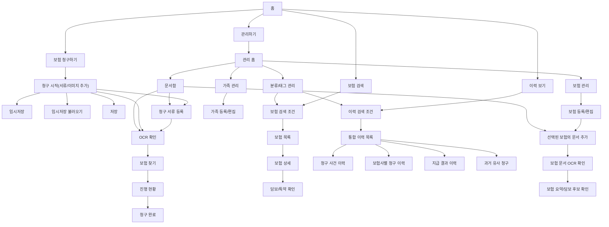

# IA Mermaid

## 1. 목적

이 문서는 `FamilyClaimRef`의 개발 전 시각화 IA를 V5.2 기준으로 정리한다.

V5.2 기준 보험 청구하기 흐름은 5단계다.

```text
1. 청구 시작(서류/이미지 추가)
2. OCR 확인
3. 보험 찾기
4. 진행 현황
5. 청구 완료
```

보험 문서는 독립 등록 대상이 아니다. 보험 조회 캡처, 보험증권, 계약서, 약관 PDF/DOCX, 기타 보험 문서는 반드시 특정 보험에 종속된다. 사용자는 먼저 보험을 등록하거나 선택한 뒤 보험 등록/편집 화면에서 문서를 연결한다.

청구 서류 등록은 보험 청구하기 흐름에 종속되며, 현재 청구 사건 후보에 병원/청구 서류를 연결한다. 문서함은 조회/관리 화면이다.

## 2. IA 다이어그램



## 3. 구조 설명

| 대메뉴 | 책임 | 주요 화면 |
|---|---|---|
| 홈 | 4개 대메뉴 진입 | `index.html`, `01_home_dashboard.html` |
| 보험 청구하기 | 청구 시작, 청구 서류 등록, OCR 확인, 보험 찾기, 진행 현황, 청구 완료 | `07_claim_case.html`, `18_claim_document_register.html`, `06_ocr_review.html`, `09_claim_reference_result.html`, `08_claim_submission.html`, `14_claim_complete.html` |
| 보험 검색 | 진단명, 진료상황, 기간, 키워드/태그 기반 보험과 담보 후보 검색 | `03_policy_list.html`, `04_policy_detail.html` |
| 이력 보기 | 관리 데이터 기반 조건으로 통합 이력 조회 | `10_history_view.html` |
| 관리하기 | 가족, 보험, 선택된 보험의 문서, 문서함, 분류/태그 관리 | `15_manage_home.html`, `02_family_members.html`, `13_family_register.html`, `11_policy_manage.html`, `12_policy_register.html`, `17_policy_document_register.html`, `05_document_box.html`, `16_category_manage.html` |

## 4. V5.2 설계 원칙

- 모든 HTML 화면 상단은 왼쪽 제목, 오른쪽 breadcrumb인 한 줄 topbar 구조로 둔다.
- 보험 청구하기는 `청구 시작(서류/이미지 추가) -> OCR 확인 -> 보험 찾기 -> 진행 현황 -> 청구 완료` 5단계로 진행한다.
- 청구 서류는 현재 청구 사건 후보에 연결한다.
- 보험 문서는 보험 등록/편집 후 선택된 보험에 연결한다.
- 약관, 계약서, 보험증권은 보험에 종속된 문서로 관리한다.
- 문서 이미지/파일 연결과 사용자의 문서 내용 확인은 분리한다.
- 문서함은 조회/관리 화면으로 제한한다.
- OCR 확인 화면은 공통 화면이지만 문서 목적, 연결 대상, 진입 출처를 구분해서 표시한다.
