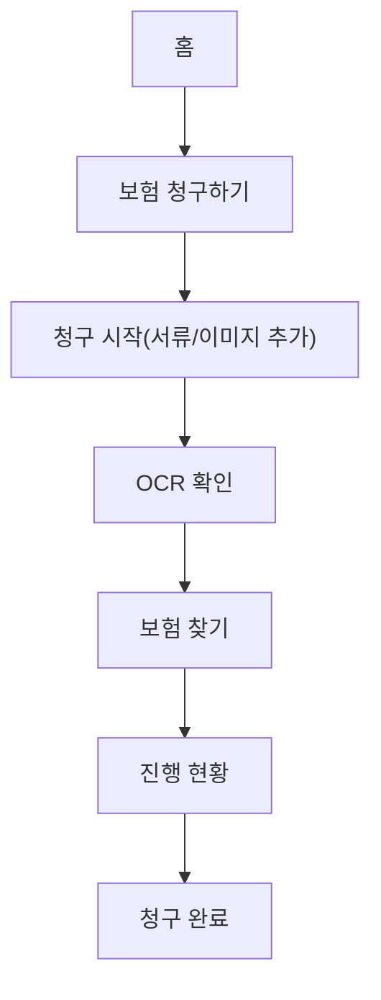
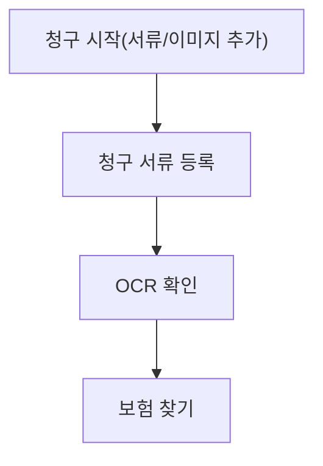
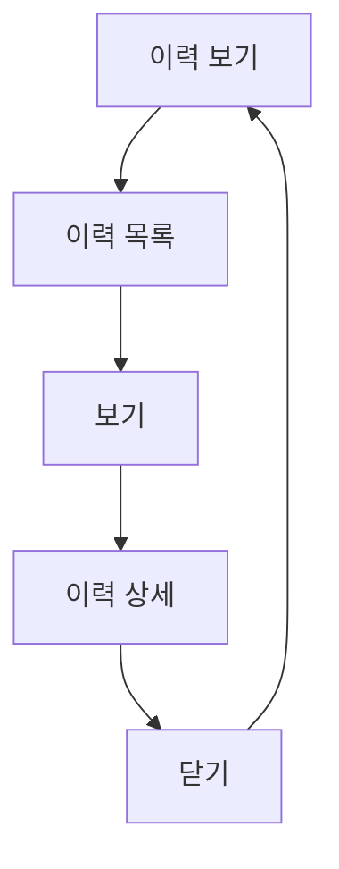
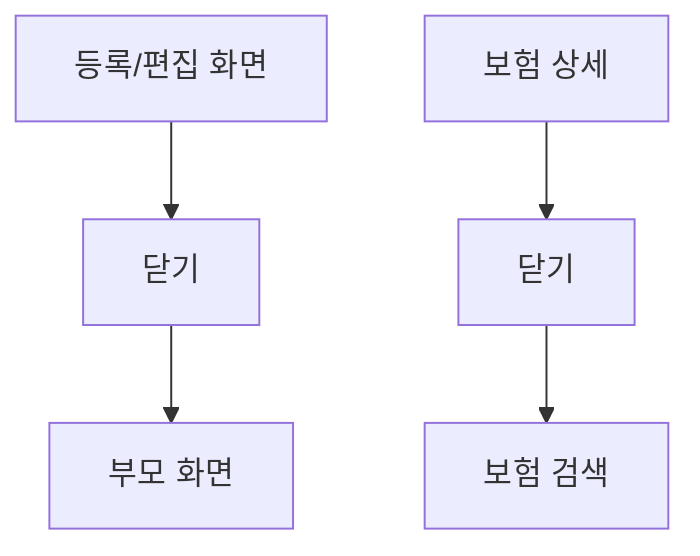
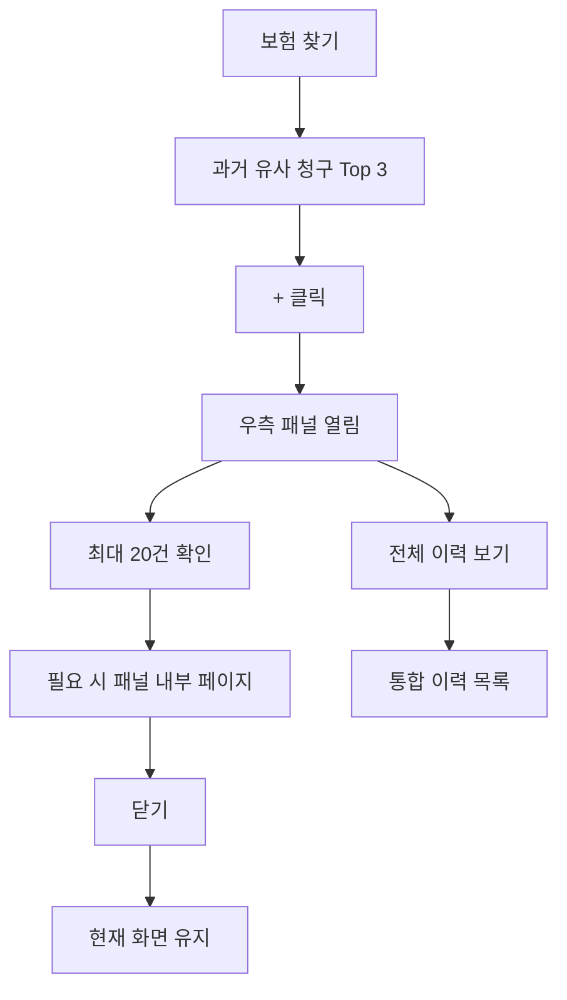
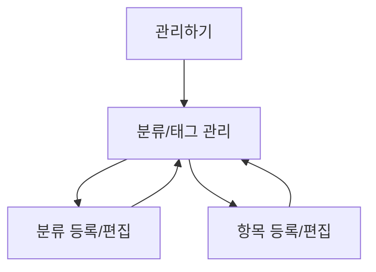

# 사용자 흐름 Mermaid

## 1. 목적

이 문서는 V5.5 기준으로 정적 Low-Fi 와이어프레임에서 검토할 사용자 흐름을 정리한다. 실제 DB, OCR, runtime 구현은 포함하지 않는다.

## 2. 보험 청구하기 5단계 흐름

## 3. 청구 서류 등록 보조 흐름

## 4. 이력 보기 상세 흐름

## 5. 등록/편집 닫기 흐름

## 6. 보험 찾기 우측 패널 흐름

## 7. 분류/태그 관리 흐름

