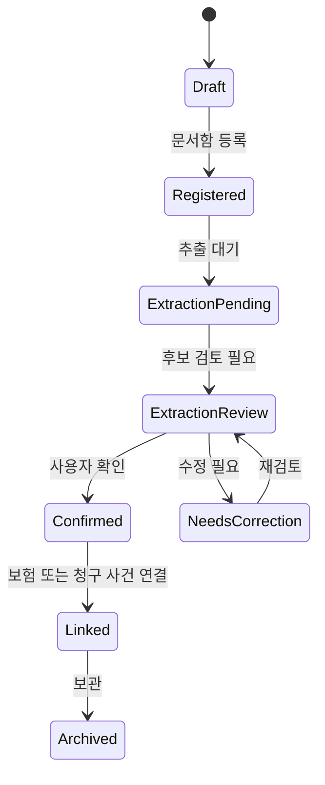
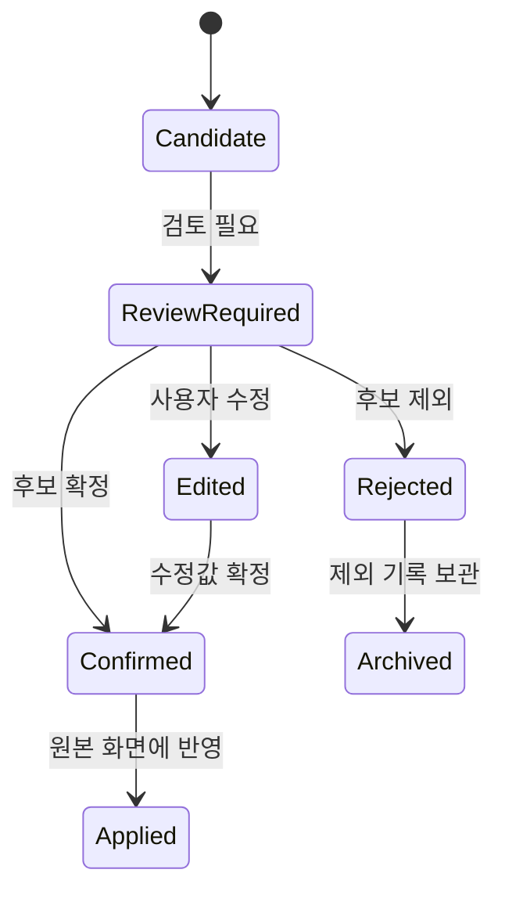
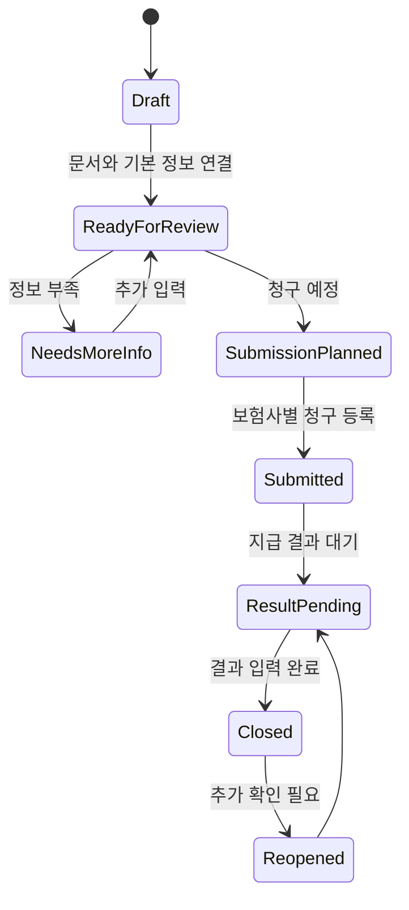
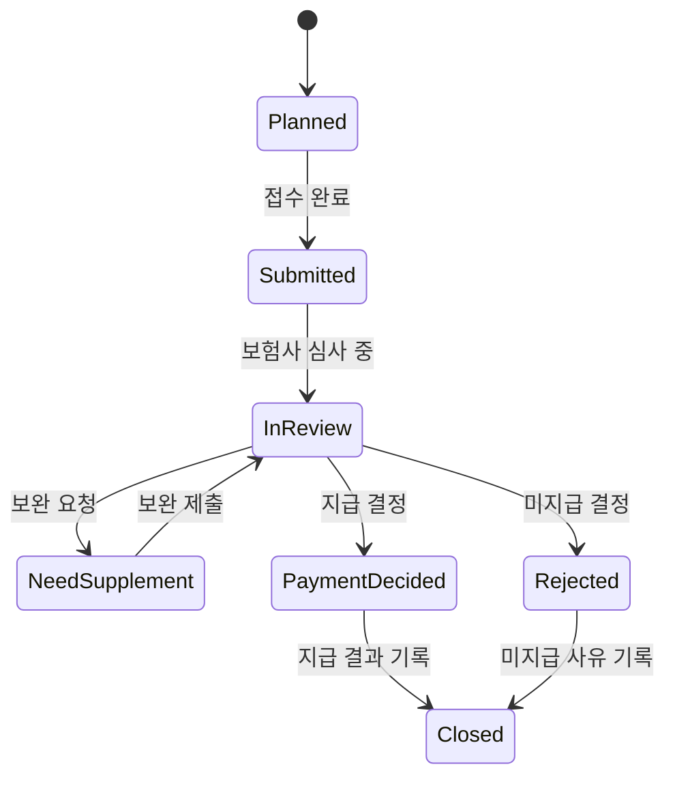
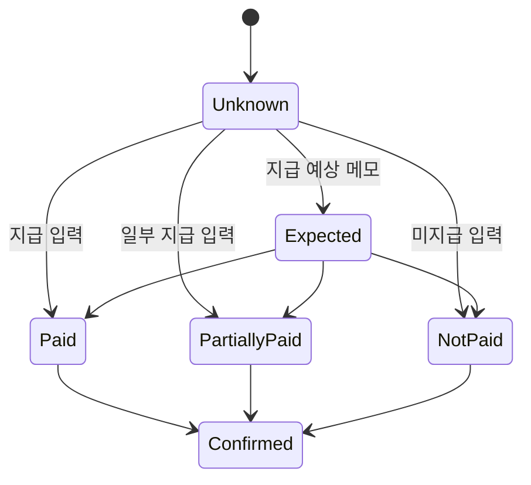

# 상태 흐름 Mermaid

## 1. 목적

이 문서는 주요 데이터 객체의 상태 전이를 개발 전 검토용 Mermaid 다이어그램으로 정리한다.

## 2. Document 상태

## 3. OCR Candidate 상태

## 4. ClaimCase 상태

## 5. ClaimSubmission 상태

## 6. ClaimPayment 상태

## 7. 상태 설계 원칙

- 자동 추출 결과는 `Confirmed`가 아니라 검토 대상 상태에서 시작한다.
- 사용자가 확인하기 전에는 보험 목록, 청구 사건, 지급 결과에 확정값으로 반영하지 않는다.
- `NeedsCorrection`, `NeedsMoreInfo`, `NeedSupplement` 상태를 통해 보류와 재검토를 명시한다.
- 지급 관련 상태는 청구 가능성 확정이 아니라 입력된 결과 기록으로만 해석한다.
